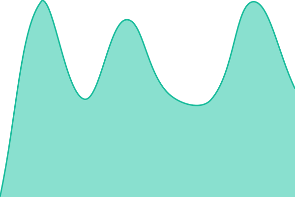
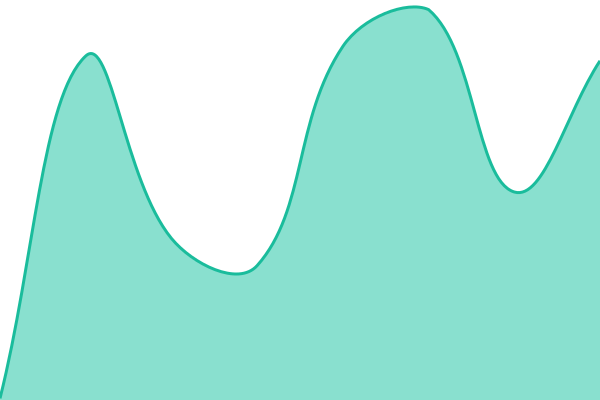
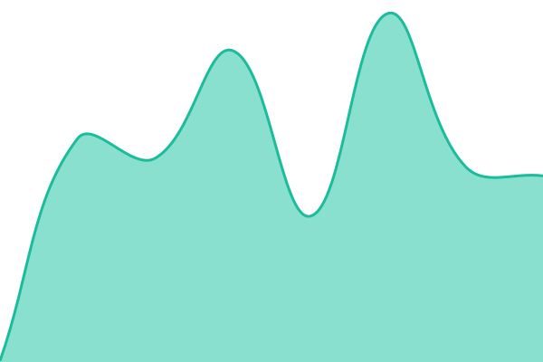
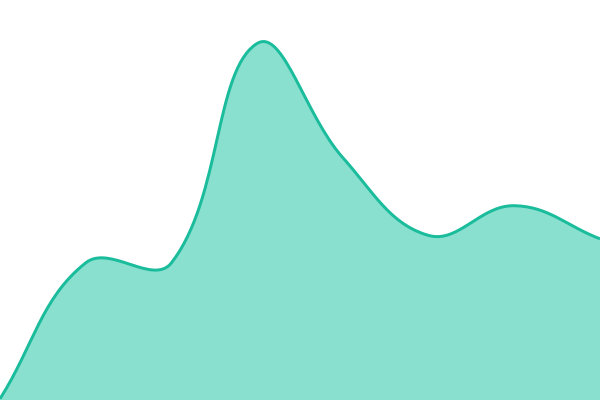
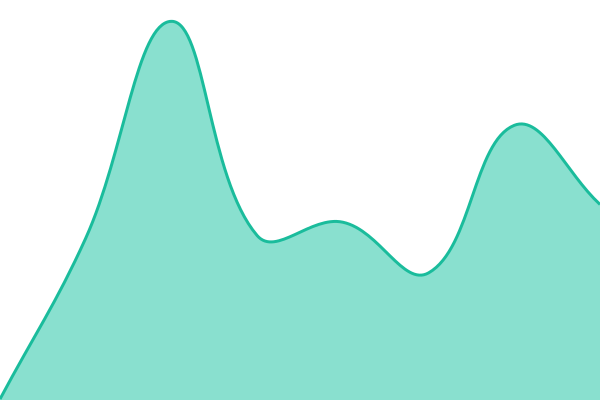

# [📈 Live Status](https://rvosmik.github.io/watchfox-status): <!--live status--> **🟩 All systems operational**

This repository contains the open-source uptime monitor and status page for [rvosmik](https://rvosmik.github.io/watchfox-status), powered by [Upptime](https://github.com/upptime/upptime).

With [Upptime](https://upptime.js.org), you can get your own unlimited and free uptime monitor and status page, powered entirely by a GitHub repository. We use [Issues](https://github.com/rvosmik/watchfox-status/issues) as incident reports, [Actions](https://github.com/rvosmik/watchfox-status/actions) as uptime monitors, and [Pages](https://rvosmik.github.io/watchfox-status) for the status page.

<!--start: status pages-->
<!-- This summary is generated by Upptime (https://github.com/upptime/upptime) -->
<!-- Do not edit this manually, your changes will be overwritten -->
<!-- prettier-ignore -->
| URL | Status | History | Response Time | Uptime |
| --- | ------ | ------- | ------------- | ------ |
|  [Watchfox App](https://app.watchfox.io/) | 🟩 Up | [watchfox-app.yml](https://github.com/rvosmik/watchfox-status/commits/HEAD/history/watchfox-app.yml) | 

 474ms
     
 | 

<a href="https://status.watchfox.io/history/watchfox-app">100.00%</a>
    

|  [Website monitoring](https://ops-eu-central.watchfox.io/healthz) | 🟩 Up | [website-monitoring.yml](https://github.com/rvosmik/watchfox-status/commits/HEAD/history/website-monitoring.yml) | 

 212ms
     
 | 

<a href="https://status.watchfox.io/history/website-monitoring">100.00%</a>
    

|  [Website monitoring verification A](https://ops-eu-west.watchfox.io/healthz) | 🟩 Up | [website-monitoring-verification-a.yml](https://github.com/rvosmik/watchfox-status/commits/HEAD/history/website-monitoring-verification-a.yml) | 

 235ms
     
 | 

<a href="https://status.watchfox.io/history/website-monitoring-verification-a">100.00%</a>
    

|  [Website monitoring verification B](https://ops-us-east.watchfox.io/healthz) | 🟩 Up | [website-monitoring-verification-b.yml](https://github.com/rvosmik/watchfox-status/commits/HEAD/history/website-monitoring-verification-b.yml) | 

 235ms
     
 | 

<a href="https://status.watchfox.io/history/website-monitoring-verification-b">100.00%</a>
    

|  [Domain monitoring](https://ops-domain.watchfox.io/healthz) | 🟩 Up | [domain-monitoring.yml](https://github.com/rvosmik/watchfox-status/commits/HEAD/history/domain-monitoring.yml) | 

 166ms
     
 | 

<a href="https://status.watchfox.io/history/domain-monitoring">100.00%</a>
    

|  [Heartbeat monitoring](https://ops-heartbeat.watchfox.io/healthz) | 🟩 Up | [heartbeat-monitoring.yml](https://github.com/rvosmik/watchfox-status/commits/HEAD/history/heartbeat-monitoring.yml) | 

 187ms
     
 | 

<a href="https://status.watchfox.io/history/heartbeat-monitoring">100.00%</a>
    

<!--end: status pages-->

[**Visit our status website →**](https://rvosmik.github.io/watchfox-status)

## 📄 License

- Powered by: [Upptime](https://github.com/upptime/upptime)
- Code: [MIT](./LICENSE) © [Anand Chowdhary](https://anandchowdhary.com), supported by [Pabio](https://pabio.com)
- Data in the `./history` directory: [Open Database License](https://opendatacommons.org/licenses/odbl/1-0/)
